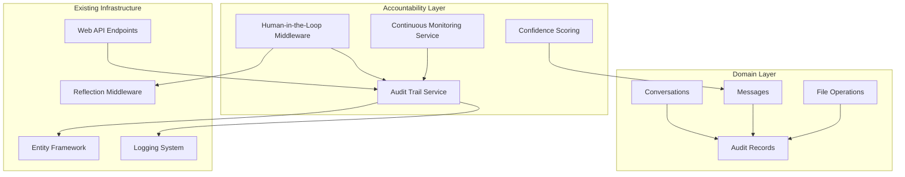

Based on my analysis of the ObsidianAI codebase, I can see it's a well-structured .NET Aspire application following Clean Architecture principles. The system already has some accountability mechanisms in place, but there are several reasonable ways to enhance it further. Here are my suggestions for implementing accountability features:

## Current Accountability Features Already Present

The codebase already includes some accountability mechanisms:

1. **Logging Infrastructure**: Comprehensive logging with `ILogger` throughout the application
2. **Reflection Middleware**: [`ReflectionFunctionMiddleware`](ObsidianAI.Infrastructure/Middleware/ReflectionFunctionMiddleware.cs:13) that validates destructive operations before execution
3. **Action Cards**: System for user confirmation of high-risk operations
4. **Exception Handling**: [`GlobalExceptionHandlingMiddleware`](ObsidianAI.Infrastructure/Middleware/GlobalExceptionHandlingMiddleware.cs:14) for structured error tracking
5. **Entity Auditing**: Timestamps on conversations and messages (CreatedAt, UpdatedAt)

## Recommended Accountability Enhancements

### 1. Enhanced Audit Trail System

**Implementation**: Create a comprehensive audit trail entity and service

```csharp
// New domain entity
public class AuditRecord
{
    public Guid Id { get; set; }
    public Guid ConversationId { get; set; }
    public Guid? MessageId { get; set; }
    public string UserId { get; set; }
    public string ActionType { get; set; } // "AI_Response", "File_Operation", "User_Action"
    public string ActionDescription { get; set; }
    public string ToolName { get; set; }
    public string Arguments { get; set; } // Serialized
    public string Result { get; set; } // Serialized
    public AuditLevel Level { get; set; } // Info, Warning, Error, Critical
    public bool RequiresHumanReview { get; set; }
    public bool ReviewedByHuman { get; set; }
    public DateTime? ReviewedAt { get; set; }
    public string? ReviewerNotes { get; set; }
    public DateTime Timestamp { get; set; } = DateTime.UtcNow;
}

public enum AuditLevel
{
    Info,
    Warning, 
    Error,
    Critical
}
```

**Why Easy**: Leverages existing EF Core infrastructure and follows established patterns in the codebase.

### 2. Confidence Score Tracking

**Implementation**: Extend the AI response model to include confidence scores

```csharp
// Extend existing Message entity
public class Message
{
    // ... existing properties ...
    
    /// <summary>
    /// AI agent's confidence level in this response (0-100)
    /// </summary>
    public int? ConfidenceScore { get; set; }
    
    /// <summary>
    /// Reasoning for low confidence score
    /// </summary>
    public string? ConfidenceReasoning { get; set; }
    
    /// <summary>
    /// Whether this response triggered human review
    /// </summary>
    public bool TriggeredHumanReview { get; set; }
}
```

**Why Easy**: Simple extension to existing entity with minimal database changes.

### 3. Human-in-the-Loop Middleware

**Implementation**: Create a new middleware for confidence-based review

```csharp
public class HumanInTheLoopMiddleware : IFunctionMiddleware
{
    private readonly ILogger<HumanInTheLoopMiddleware> _logger;
    private readonly IAuditService _auditService;
    
    public async ValueTask<object?> InvokeAsync(
        FunctionInvocationContext context,
        Func<ValueTask<object?>> next,
        CancellationToken cancellationToken)
    {
        // Check confidence score from previous AI response
        var confidence = ExtractConfidenceFromContext(context);
        
        if (confidence < 70) // Configurable threshold
        {
            _logger.LogWarning("Low confidence ({Confidence}%) detected for {FunctionName}", confidence, context.Function.Name);
            
            // Create audit record requiring review
            await _auditService.CreateAuditRecordAsync(new AuditRecord
            {
                ActionDescription = $"Low confidence operation: {context.Function.Name}",
                RequiresHumanReview = true,
                Level = AuditLevel.Warning
            });
            
            // Could block or proceed with warning based on configuration
            if (ShouldBlockForLowConfidence(context.Function.Name))
            {
                context.Terminate = true;
                context.Result = CreateHumanReviewResponse(context.Function.Name, confidence);
                return context.Result;
            }
        }
        
        return await next();
    }
}
```

**Why Easy**: Builds on existing middleware pattern and integrates with current logging.

### 4. Operation Monitoring Dashboard

**Implementation**: Add new API endpoints for monitoring

```csharp
// New endpoints in addition to existing AIEndpoints.cs
public static class MonitoringEndpoints
{
    public static IEndpointRouteBuilder MapMonitoringEndpoints(this IEndpointRouteBuilder app)
    {
        var group = app.MapGroup("/api/monitoring")
            .WithTags("Monitoring");
            
        group.MapGet("/audit-trail", GetAuditTrail)
            .WithName("GetAuditTrail")
            .WithOpenApi();
            
        group.MapGet("/pending-reviews", GetPendingReviews)
            .WithName("GetPendingReviews")
            .WithOpenApi();
            
        group.MapPost("/review/{auditId}", CompleteReview)
            .WithName("CompleteReview")
            .WithOpenApi();
            
        return app;
    }
}
```

**Why Easy**: Leverages existing endpoint patterns and Minimal APIs.

### 5. Enhanced File Operation Tracking

**Implementation**: Extend existing [`FileOperationRecord`](ObsidianAI.Domain/Entities/FileOperationRecord.cs:8) entity

```csharp
public class FileOperationRecord
{
    // ... existing properties ...
    
    /// <summary>
    /// Backup of file content before modification (for critical files)
    /// </summary>
    public string? BackupContent { get; set; }
    
    /// <summary>
    /// Risk level assessment of this operation
    /// </summary>
    public OperationRiskLevel RiskLevel { get; set; }
    
    /// <summary>
    /// Whether this operation was approved by human review
    /// </summary>
    public bool HumanApproved { get; set; }
    
    /// <summary>
    /// User ID of the human reviewer
    /// </summary>
    public string? ReviewedBy { get; set; }
}

public enum OperationRiskLevel
{
    Low,      // Read operations, new file creation
    Medium,   // File modifications
    High,     // File deletions, bulk operations
    Critical  // System file modifications
}
```

**Why Easy**: Simple extension to existing entity that already tracks file operations.

### 6. Continuous Monitoring Service

**Implementation**: Background service for monitoring system health

```csharp
public class AccountabilityMonitoringService : BackgroundService
{
    private readonly ILogger<AccountabilityMonitoringService> _logger;
    private readonly IAuditService _auditService;
    private readonly IServiceProvider _serviceProvider;
    
    protected override async Task ExecuteAsync(CancellationToken stoppingToken)
    {
        while (!stoppingToken.IsCancellationRequested)
        {
            await CheckForAnomalousActivity();
            await CheckForPendingReviews();
            await GenerateDailyReport();
            
            await Task.Delay(TimeSpan.FromHours(1), stoppingToken);
        }
    }
    
    private async Task CheckForAnomalousActivity()
    {
        // Check for unusual patterns like:
        // - High frequency of destructive operations
        // - Operations on sensitive file paths
        // - Low confidence operations
        // - Failed reflection validations
    }
}
```

**Why Easy**: Uses .NET's built-in BackgroundService and integrates with existing DI container.

## Implementation Priority

1. **Start with Audit Trail** - Foundation for all other accountability features
2. **Add Confidence Tracking** - Minimal effort, immediate value
3. **Implement Human-in-the-Loop Middleware** - Builds on existing patterns
4. **Create Monitoring Endpoints** - Leverages existing API structure
5. **Add Background Monitoring** - Advanced feature for production readiness

## Mermaid Architecture Diagram



These suggestions build incrementally on your existing clean architecture while adding comprehensive accountability features. The implementation would be straightforward since it leverages patterns already established in your codebase.