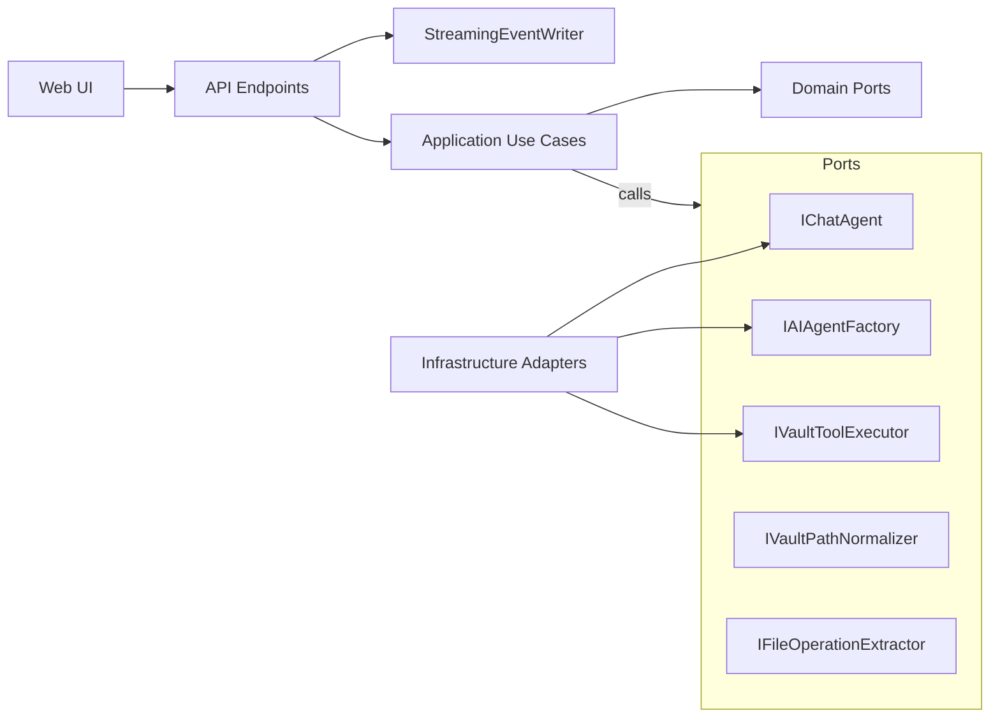

Implementation plan to resolve identified violations while keeping routes unchanged

Grounding observations from current code
- Layer mixing
  - API DTOs and configuration classes are combined in [ObsidianAI.Api/Models/Records.cs](ObsidianAI.Api/Models/Records.cs).
  - Endpoint orchestration lives in [ObsidianAI.Api/Program.cs](ObsidianAI.Api/Program.cs:101), including regex-based file-operation extraction and SSE shaping logic.
  - Agent construction and lifecycle + chat orchestration are bundled in [InitializeAgentAsync()](ObsidianAI.Api/Services/ObsidianAssistantService.cs:63) and [StreamChatAsync()](ObsidianAI.Api/Services/ObsidianAssistantService.cs:114).

- SOLID issues
  - Single Responsibility: [ObsidianAssistantService](ObsidianAI.Api/Services/ObsidianAssistantService.cs) simultaneously manages agent creation, initialization, logging, chat, and streaming.
  - Dependency Inversion: Direct dependency on McpClient in [ObsidianAI.Api/Program.cs](ObsidianAI.Api/Program.cs:223) and within [ObsidianAssistantService](ObsidianAI.Api/Services/ObsidianAssistantService.cs:21).
  - Open/Closed: Provider selection is hardcoded in [ObsidianAI.Api/Program.cs](ObsidianAI.Api/Program.cs:18) using a conditional switch between factories.

- DRY issues
  - Repeated try/catch + logging pattern across web client methods in [ObsidianAI.Web/Services/ChatService.cs](ObsidianAI.Web/Services/ChatService.cs).
  - SSE shaping duplicated between API stream endpoint [Program.cs](ObsidianAI.Api/Program.cs:154) and SignalR hub [ChatHub.StreamMessage](ObsidianAI.Web/Hubs/ChatHub.cs:24).
  - API base address resolution duplicated in [ObsidianAI.Web/Program.cs](ObsidianAI.Web/Program.cs:16) for named and typed HttpClient.

Target architecture (Clean Architecture split)
- Projects
  - ObsidianAI.Domain: pure domain models and ports (no dependencies).
  - ObsidianAI.Application: use cases and policies; depends only on Domain.
  - ObsidianAI.Infrastructure: provider adapters for LLM and MCP, configuration binding, DI extensions; depends on Domain and Application ports to implement.
  - ObsidianAI.Api: presentation/transport (minimal endpoints mapping to use cases).
  - ObsidianAI.Web: UI remains; consume unchanged routes.

- Ports (Domain)
  - IChatAgent: SendAsync and StreamAsync abstractions for chat.
  - IAIAgentFactory: builds IChatAgent using configured provider.
  - IVaultToolExecutor: encapsulates vault operations currently using McpClient.
  - IVaultPathNormalizer: deterministic vault path normalization policy.
  - IFileOperationExtractor: structured extraction of file operations from text.

- Use cases (Application)
  - StartChatUseCase: orchestrates a one-shot chat; uses IAIAgentFactory, IFileOperationExtractor.
  - StreamChatUseCase: streams tokens/messages; uses IAIAgentFactory; returns an application stream of events (text chunks, tool-call markers).
  - ModifyVaultUseCase: normalizes operation, invokes IVaultToolExecutor, returns ModifyResponse.
  - SearchVaultUseCase: placeholder using port for future MCP-backed search.

- Infrastructure adapters
  - LmStudioChatAgent and OpenRouterChatAgent: wrap Microsoft.Extensions.AI/OpenAI client; replace direct creation in [LmStudioClientFactory](ObsidianAI.Api/Services/LmStudioClientFactory.cs) and [OpenRouterClientFactory](ObsidianAI.Api/Services/OpenRouterClientFactory.cs).
  - McpVaultToolExecutor: wraps [McpClientService.Client](ObsidianAI.Api/Services/McpClientService.cs) and provides strongly-typed Execute methods for append/patch/delete/create.
  - Configuration classes (AppSettings, LlmSettings, LmStudioSettings, OpenRouterSettings) moved out of [ObsidianAI.Api/Models/Records.cs](ObsidianAI.Api/Models/Records.cs) into Infrastructure.Configuration.

- API presentation
  - Endpoints delegate to use cases; contracts and routes unchanged:
    - POST /chat -> StartChatUseCase
    - POST /chat/stream -> StreamChatUseCase piped into a StreamingEventWriter (centralized SSE formatter).
    - POST /vault/modify -> ModifyVaultUseCase
    - POST /vault/search, /vault/reorganize -> Application use cases (placeholders ok initially).
  - Replace regex in [Program.cs ExtractFileOperationResult](ObsidianAI.Api/Program.cs:116) with IFileOperationExtractor injected policy.

- Web DRY improvements
  - Introduce DelegatingHandler for HttpClient to centralize logging/error handling; refactor calls in [ChatService](ObsidianAI.Web/Services/ChatService.cs) to a single ExecuteAsync helper to remove repeated try/catch blocks.
  - Centralize API base address selection in a single helper for both HttpClient registrations in [ObsidianAI.Web/Program.cs](ObsidianAI.Web/Program.cs:16).

Mermaid high-level flow

Migration mapping (current -> target)
- Agent lifecycle and chat execution
  - From [InitializeAgentAsync()](ObsidianAI.Api/Services/ObsidianAssistantService.cs:63) and agent creation to IAIAgentFactory + IChatAgent adapters in Infrastructure; orchestration moved into StartChatUseCase and StreamChatUseCase.
- SSE shaping
  - From [Program.cs stream endpoint](ObsidianAI.Api/Program.cs:154) custom logic to StreamingEventWriter; hub remains consumer of SSE; keep event names data and tool_call; preserve [DONE] marker and error event.
- MCP vault operations
  - From [Program.cs /vault/modify](ObsidianAI.Api/Program.cs:223) direct McpClient tool calls to ModifyVaultUseCase + IVaultToolExecutor.
- File operation extraction
  - From [Program.cs static ExtractFileOperationResult](ObsidianAI.Api/Program.cs:116) to IFileOperationExtractor policy in Application/Domain.

DI and configuration plan
- Add Infrastructure DI extension method AddObsidianAI(IServiceCollection, IConfiguration):
  - Bind Infrastructure.Configuration classes.
  - Register IAIAgentFactory keyed by Provider = LMStudio|OpenRouter (from config).
  - Register IChatAgent adapters, IVaultToolExecutor, IVaultPathNormalizer, IFileOperationExtractor.
  - Register McpClientService as hosted and expose McpClient via the executor only; remove direct singleton McpClient from Program composition root.
- Simplify [ObsidianAI.Api/Program.cs](ObsidianAI.Api/Program.cs:18) to a single builder.Services.AddObsidianAI(Configuration) and presentation-only mappings.

Error handling and DRY
- API: Add ProblemDetails middleware and logging filter; endpoints delegate to use cases and return Results-mapped outputs; catch only to translate domain/application exceptions.
- Web: DelegatingHandler for consistent logging/timeouts; ChatService uses one ExecuteAsync wrapper.

Acceptance criteria
- API routes, payloads, and SSE wire format remain unchanged; streaming still emits incremental data: lines and tool_call events, with [DONE] sentinel and error event.
- Providers switchable via configuration without changing [Program.cs](ObsidianAI.Api/Program.cs).
- Build succeeds across solution; warnings treated as errors per rules.
- Tests:
  - Unit: IVaultPathNormalizer and IFileOperationExtractor policies.
  - Use cases: StartChat, StreamChat, ModifyVault with mocked ports.
  - Integration: provider selection via IAIAgentFactory.

Risks and mitigations
- SSE behavior drift: Mitigate by snapshotting current SSE behavior from [Program.cs](ObsidianAI.Api/Program.cs:154) and [ChatHub](ObsidianAI.Web/Hubs/ChatHub.cs:24) and asserting equivalence via a streaming contract test.
- Provider adapter differences: Wrap provider-specific quirks inside adapters; keep IChatAgent contract narrow (text-only) initially.
- McpClient lifecycle: Retain hosted initialization pattern from [McpClientService](ObsidianAI.Api/Services/McpClientService.cs) but hide behind IVaultToolExecutor; ensure lazy-singleton semantics preserved.

Sequenced execution plan aligned to current TODO list
- Create projects and references; wire solution with clean layering.
- Define ports and move core domain abstractions; separate API DTOs from domain.
- Move configuration classes into Infrastructure.Configuration and bind.
- Implement LLM adapters and McpVaultToolExecutor.
- Add DI extension AddObsidianAI and replace composition in Program.
- Implement use cases; replace endpoint bodies with simple delegations.
- Introduce StreamingEventWriter and remove SSE duplication from Program.
- Refactor/remove ObsidianAssistantService after use case parity.
- Web DRY: add DelegatingHandler and centralize API base address logic.
- Add ProblemDetails middleware in API, simplify error handling.
- Add tests; validate via Aspire.
